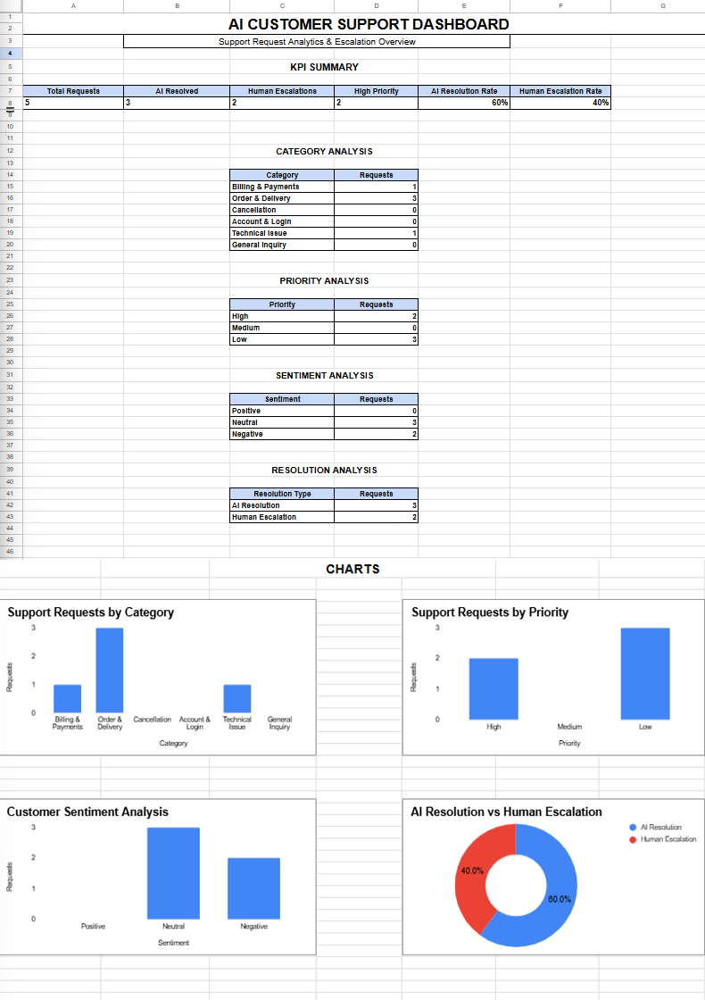

# 🤖 AI Customer Support Automation

An AI-powered customer support automation system built with **n8n** to classify customer requests, analyze sentiment and priority, provide AI-based resolutions, escalate complex cases to humans, and track support performance through an analytics dashboard.

## 📊 Dashboard

## 🚀 Project Overview

This project automates the customer support process using an n8n workflow and AI.

The system receives customer support requests, analyzes them using AI, determines the category, priority, sentiment, and whether human intervention is required, and then routes the request accordingly.

Support activity is also recorded and visualized through an analytics dashboard.

## 🔄 Workflow

Customer Support Request
          ↓
      n8n Webhook
          ↓
       AI Agent
          ↓
  AI Analysis & Classification
          ↓
   Human Required?
      ↙          ↘
    NO            YES
     ↓             ↓
AI Resolution   Human Escalation
     ↓             ↓
     └──────┬──────┘
            ↓
    Support Data Logging
            ↓
     Analytics Dashboard
## ✨ Key Features

- Customer support request intake through n8n
- AI-based request classification
- Priority detection
- Sentiment analysis
- Automated AI resolution
- Human escalation for complex requests
- Support request data logging
- Analytics dashboard for monitoring support performance

## 📈 Dashboard Metrics

The dashboard provides insights into:

- Total support requests
- AI-resolved requests
- Human escalations
- High-priority requests
- AI resolution rate
- Human escalation rate
- Request category distribution
- Priority distribution
- Customer sentiment
- Resolution type

## 🛠️ Technologies Used

- **n8n** — Workflow automation
- **AI Agent / LLM** — Customer request analysis and resolution
- **Google Sheets** — Support data logging
- **Google Sheets Dashboard** — Analytics and visualization
- **Webhook** — Customer request intake

## 📁 Repository Contents

| File | Description |
|------|-------------|
| `AI CUSTOMER SUPPORT WORKFLOW.JSON` | Exported n8n workflow configuration |
| `AI_Customer_Support_Dashboard_Full_Screenshot.png` | Complete analytics dashboard |
| `README.md` | Project documentation |

## 🎯 Project Outcome

The project demonstrates how AI and workflow automation can be combined to streamline customer support operations, automatically handle common requests, identify high-priority cases, and escalate cases requiring human assistance.

## 👩‍💻 Author

**Varsani A**

B.Tech Information Technology
